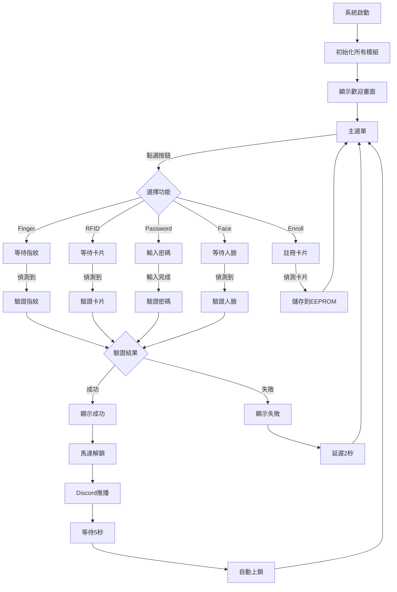

# ESP32智慧門鎖學習專案

一個基於 ESP32 的完整智慧門鎖系統，整合四重認證方式（RFID 卡片、指紋辨識、人臉辨識、數字密碼），搭配觸控螢幕操作介面與 WiFi 推播功能。這是一個功能完整的嵌入式系統專案，程式碼包含詳細的技術說明與 datasheet 章節標註。

## 📋 專案概述

### 功能特色
- 🔐 **四重認證**: RFID卡片 + 指紋辨識 + 人臉辨識 + 數字密碼
- 🤖 **AI 視覺辨識**: HuskyLens 智慧鏡頭支援人臉學習與辨識
- 📺 **觸控螢幕**: TFT 彩色顯示器即時顯示狀態，支援觸控操作
- 🔓 **自動上鎖**: 解鎖 5 秒後自動重新上鎖
- 📡 **WiFi 推播**: 解鎖成功時自動發送 Discord 通知
- 🔒 **安全機制**: 密碼錯誤 3 次鎖定 30 秒

### 硬體組成
| 模組 | 型號 | 用途 | 通訊介面 |
|------|------|------|----------|
| 主控制器 | ESP32-WROOM-32 | 系統核心 | - |
| RFID讀卡器 | MFRC522 | 卡片辨識 | SPI |
| 指紋感應器 | AS608 | 指紋辨識 | UART |
| AI 智慧鏡頭 | HuskyLens | 人臉辨識 | UART |
| 伺服馬達 | SG90 | 門鎖控制 | PWM |
| TFT顯示器 | ILI9341/ST7789 | 狀態顯示與觸控 | SPI |

## 🎯 系統運作流程

系統採用狀態機設計，支援四種認證方式，流程如下：



## 🗂️ 專案結構

```
smart_lock_junior/
├── platformio.ini                 # PlatformIO 配置文件
├── src/
│   ├── main.cpp                  # 主程式（狀態機邏輯）
│   ├── rfid.cpp                  # RFID 模組實作（MFRC522）
│   ├── fingerprint.cpp           # 指紋模組實作（AS608）
│   ├── huskylens.cpp             # HuskyLens AI 鏡頭實作
│   ├── motor.cpp                 # 伺服馬達實作（SG90）
│   ├── screen.cpp                # TFT 顯示器與觸控實作
│   ├── password.cpp              # 密碼管理實作
│   └── wifi_comm.cpp             # WiFi 與 Discord 推播實作
├── include/
│   ├── config.h                  # 硬體接腳定義與系統配置
│   ├── rfid.h                    # RFID 模組介面宣告
│   ├── fingerprint.h             # 指紋模組介面宣告
│   ├── husky_lens.h              # HuskyLens 模組介面宣告
│   ├── motor.h                   # 伺服馬達介面宣告
│   ├── screen.h                  # 顯示器與觸控介面宣告
│   ├── password.h                # 密碼管理介面宣告
│   └── wifi_comm.h               # WiFi 通訊介面宣告
└── README.md                     # 本文件
```

### 程式架構說明

本專案採用**標頭檔+實作檔案**的 C++ 標準架構：

- **標頭檔 (.h)**: 位於 `include/` 目錄
  - 類別宣告與函式介面
  - 詳細的 datasheet 章節註解
  - 參數說明與使用範例

- **實作檔 (.cpp)**: 位於 `src/` 目錄
  - 完整的功能實作
  - 詳細的技術說明與註解
  - datasheet 對應章節標註

這種架構的優點：
- ✅ 清晰的介面與實作分離
- ✅ 更好的編譯優化
- ✅ 符合 C++ 專案最佳實踐
- ✅ 便於模組化開發與測試
- ✅ 各模組可獨立測試與維護

## 🔌 硬體連接

### ESP32 GPIO接腳分配

```
┌─────────────────────────────────────────────────────────────┐
│                        ESP32-WROOM-32                        │
├──────────┬──────────────────────────────────────────────────┤
│ GPIO Pin │ 功能                       │ 連接模組            │
├──────────┼──────────────────────────────────────────────────┤
│    23    │ SPI MOSI (共用)            │ MFRC522 + TFT       │
│    19    │ SPI MISO                   │ MFRC522             │
│    18    │ SPI SCK (共用)             │ MFRC522 + TFT       │
│     5    │ RFID SS (Chip Select)      │ MFRC522             │
│    22    │ RFID RST (Reset)           │ MFRC522             │
├──────────┼──────────────────────────────────────────────────┤
│    17    │ UART TX (指紋)             │ AS608 RX            │
│    16    │ UART RX (指紋)             │ AS608 TX            │
├──────────┼──────────────────────────────────────────────────┤
│    25    │ UART TX (AI 鏡頭)          │ HuskyLens RX (綠)   │
│    26    │ UART RX (AI 鏡頭)          │ HuskyLens TX (藍)   │
├──────────┼──────────────────────────────────────────────────┤
│    13    │ PWM (Servo Control)        │ SG90 Signal         │
├──────────┼──────────────────────────────────────────────────┤
│    15    │ TFT CS (Chip Select)       │ ILI9341/ST7789      │
│     2    │ TFT DC (Data/Command)      │ ILI9341/ST7789      │
│     4    │ TFT RST (Reset)            │ ILI9341/ST7789      │
└──────────┴──────────────────────────────────────────────────┘
```

### 電源連接
```
ESP32 3.3V  →  MFRC522 VCC, AS608 VCC, TFT VCC
ESP32 5V    →  SG90 VCC, HuskyLens VCC (建議外部 5V 電源)
ESP32 GND   →  所有模組 GND (務必共地！)
```

⚠️ **重要**: 
- HuskyLens 和 SG90 需要 5V 供電，電流需求較大
- 建議使用外部 5V 電源供應器（至少 2A）
- 務必確保所有模組共地（GND 連接在一起）

### 快速參考表

| 模組 | ESP32 接腳 | 備註 |
|------|-----------|------|
| **MFRC522 (RFID)** | CS=5, RST=22, MOSI=23, MISO=19, SCK=18 | 3.3V 供電，SPI |
| **AS608 (指紋)** | TX=17, RX=16 | 3.3V 供電，UART (57600) |
| **HuskyLens (AI)** | TX=25, RX=26 | 5V 供電，UART (9600) |
| **SG90 (馬達)** | Signal=13 | 5V 供電，PWM |
| **ST7789 (TFT)** | CS=15, DC=2, RST=4, MOSI=23, SCK=18 | 3.3V 供電，SPI |
| **XPT2046 (觸控)** | 共用 SPI | 觸控校準參數在 config.h |

### 詳細接線圖

#### MFRC522 RFID 模組
```
MFRC522    ESP32
-----------------
VCC    →   3.3V
GND    →   GND
RST    →   GPIO22
MISO   →   GPIO19
MOSI   →   GPIO23
SCK    →   GPIO18
SDA(SS)→   GPIO5
```

#### AS608 指紋感應器
```
AS608      ESP32
-----------------
VCC    →   3.3V
GND    →   GND
TX     →   GPIO16 (RX)
RX     →   GPIO17 (TX)
```

#### HuskyLens AI 智慧鏡頭
```
HuskyLens    ESP32
-------------------
VCC (紅)  →   5V
GND (黑)  →   GND
TX (藍)   →   GPIO26 (RX)
RX (綠)   →   GPIO25 (TX)
```
⚠️ **注意**: 
- HuskyLens 需要 5V 供電（電流約 320mA）
- UART 訊號為 3.3V 相容，可直接連接 ESP32
- 波特率：9600（已在程式中設定）
- 通訊協定：UART（需在 HuskyLens 設定中選擇）

#### SG90 伺服馬達
```
SG90          電源
--------------------
橙色/黃色  →   GPIO13 (Signal)
紅色       →   5V (外部電源建議)
棕色/黑色  →   GND
```
⚠️ **重要**: SG90 需要較大電流，建議使用外部 5V 電源供應器，並與 ESP32 共地。

#### ILI9341/ST7789 顯示器
```
TFT        ESP32
-----------------
VCC    →   3.3V
GND    →   GND
CS     →   GPIO15
RESET  →   GPIO4
DC     →   GPIO2
MOSI   →   GPIO23 (與 MFRC522 共用)
SCK    →   GPIO18 (與 MFRC522 共用)
LED    →   3.3V (或 GPIO 控制亮度)
```

## ⚙️ 系統配置

### WiFi 與 Discord 推播設定

系統支援 WiFi 連線與 Discord 推播通知，需在程式中設定：

#### 1. WiFi 設定
編輯 `src/wifi_comm.cpp`：
```cpp
void wifi_comm::init() {
  ssid = "你的WiFi名稱";        // 修改此處
  password = "你的WiFi密碼";    // 修改此處
  // ...
}
```

#### 2. Discord Webhook 設定
編輯 `include/config.h`：
```cpp
#define DISCORD_WEBHOOK_URL "https://discord.com/api/webhooks/你的Webhook網址"
```

**取得 Discord Webhook URL**:
1. 在 Discord 伺服器中建立頻道
2. 頻道設定 → 整合 → Webhooks → 新增 Webhook
3. 複製 Webhook URL 並貼到 `config.h`

#### 3. 觸控校準（如觸控不準）
編輯 `include/config.h`：
```cpp
#define TS_MINX 380    // 根據實際測試調整
#define TS_MAXX 3680
#define TS_MINY 340
#define TS_MAXY 3740
```
使用 `screen.printTouchDebug()` 查看原始座標並調整。

## 🚀 快速開始

### 環境需求
- [PlatformIO](https://platformio.org/) (VSCode 擴展或 CLI)
- USB 傳輸線（連接 ESP32）
- 各硬體模組（如上述列表）
- WiFi 網路（2.4GHz）

### 安裝步驟

1. **克隆/下載專案**
   ```bash
   cd smart_lock_junior
   ```

2. **開啟PlatformIO**
   - VSCode: 安裝PlatformIO IDE擴展
   - 或使用PlatformIO CLI

3. **連接硬體**
   - 按照上述接線圖連接所有模組
   - 確保電源與GND正確連接
   - **檢查共地**: 所有模組GND必須連接在一起

4. **編譯專案**
   ```bash
   pio run
   ```

5. **上傳到ESP32**
   ```bash
   pio run --target upload
   ```

6. **開啟Serial監視器 (Debug用)**
   ```bash
   pio device monitor
   ```
   或在VSCode中使用PlatformIO的Serial Monitor。

### 首次運行

首次上傳後，TFT 螢幕會顯示歡迎畫面，Serial Monitor 會輸出：

```
================================
智慧門鎖系統啟動中...
================================
初始化 HUSKYLENS 模組...
HUSKYLENS 連線成功！
已切換到人臉辨識模式
HUSKYLENS 初始化完成！

初始化 TFT 顯示器...
初始化觸控功能...

初始化 RFID 模組...
RFID 模組初始化成功
已註冊卡片數量: 0

初始化指紋感應器...
指紋感應器初始化成功

初始化密碼管理...
密碼初始化完成（預設密碼: 1234）

初始化 WiFi...
正在連線到 WiFi...
WiFi 連線成功！
IP: 192.168.x.x

系統準備就緒！
```

**操作說明**：
1. **觸控螢幕**會顯示主選單，有 6 個按鈕
2. **預設密碼**: `1234`（可透過密碼管理功能修改）
3. **註冊卡片**: 點選「Enroll」按鈕，將卡片靠近 RFID 讀卡器
4. **註冊指紋**: 需自行呼叫 `fingerSensor.enrollFinger(id)`
5. **註冊人臉**: 在 HuskyLens 上按學習按鈕，或透過程式呼叫 `aiCamera.learnFace(id)`
6. **解鎖測試**: 點選任一認證方式按鈕進行測試

## 🤖 HuskyLens AI 視覺辨識

### 功能特色
- **人臉辨識**: 支援多使用者註冊與辨識
- **人臉學習**: 可動態新增使用者（ID 1-255）
- **多演算法**: 支援物體追蹤、顏色辨識、標籤辨識等 7 種模式
- **UART 通訊**: 透過 Serial2（GPIO25/26）與 ESP32 通訊
- **即時偵測**: 9600 波特率，低延遲回應
- **離線運算**: AI 運算在 HuskyLens 本地執行，不需網路

### 使用方式

#### 人臉驗證流程
1. 在主選單點選「Face」按鈕
2. 將臉部對準 HuskyLens 鏡頭
3. 綠色方框表示偵測到人臉
4. 藍色方框 + ID 表示辨識成功
5. 驗證通過後自動解鎖（5 秒後重新上鎖）

#### 人臉註冊流程（需自行實作 UI）
1. 在 HuskyLens 螢幕上按下「學習」按鈕
2. 或透過程式呼叫 `aiCamera.learnFace(id)`
3. 將臉部對準鏡頭
4. 等待 HuskyLens 學習（約 3-5 秒）
5. 學習完成後會顯示新的 ID

### 支援的演算法模式

HuskyLens 支援以下 7 種 AI 演算法：

- `ALGORITHM_FACE_RECOGNITION`: **人臉辨識**（預設，本專案使用）
- `ALGORITHM_OBJECT_TRACKING`: 物體追蹤
- `ALGORITHM_OBJECT_RECOGNITION`: 物體辨識
- `ALGORITHM_LINE_TRACKING`: 線條追蹤
- `ALGORITHM_COLOR_RECOGNITION`: 顏色辨識
- `ALGORITHM_TAG_RECOGNITION`: 標籤辨識（AprilTag）
- `ALGORITHM_OBJECT_CLASSIFICATION`: 物體分類

### API 說明

```cpp
HuskyLens aiCamera;

// 初始化（在 setup() 中）
aiCamera.init();

// 偵測人臉
if (aiCamera.detectFace()) {
  Serial.println("偵測到人臉！");
}

// 辨識人臉並取得 ID
int faceID = aiCamera.recognizeFace();
if (faceID > 0) {
  Serial.printf("辨識到使用者 ID: %d\n", faceID);
} else if (faceID == 0) {
  Serial.println("偵測到未註冊的人臉");
}

// 驗證人臉（已註冊）
if (aiCamera.verifyFace()) {
  Serial.println("驗證成功！");
  doorMotor.unlock();
}

// 學習新人臉（ID 1-255）
if (aiCamera.learnFace(1)) {
  Serial.println("人臉註冊成功！ID: 1");
}

// 切換演算法模式
aiCamera.setAlgorithm(ALGORITHM_COLOR_RECOGNITION);

// 獲取偵測到的物件數量
int count = aiCamera.getObjectCount();
```

### 故障排除

#### HuskyLens 連線失敗
- **症狀**: Serial 顯示「HUSKYLENS 連線失敗！請檢查接線」
- **檢查**:
  1. TX/RX 是否交叉連接（HuskyLens TX → ESP32 GPIO26）
  2. 波特率是否為 9600
  3. 電源是否為 5V（電流足夠）
  4. HuskyLens 螢幕是否正常顯示
  5. HuskyLens 設定中通訊協定是否選擇「UART」
- **測試**: 
  - 檢查 HuskyLens 螢幕是否正常開機
  - 在 HuskyLens 設定中切換為「I2C」再切回「UART」
  - 確認接線沒有鬆脫

#### 無法辨識人臉
- **原因**: 未學習人臉或光線不足
- **解決**:
  1. 確認已執行人臉學習（`learnFace()` 或按 HuskyLens 學習鈕）
  2. 確保充足光線（避免背光或過暗環境）
  3. 距離鏡頭 20-50cm
  4. 正面面對鏡頭（避免側臉或遮擋）
  5. HuskyLens 設定確認在「人臉辨識」模式

#### 辨識率低或誤判
- **優化建議**:
  1. 學習時保持多角度（正面、微側面）
  2. 學習時光線條件與使用時相似
  3. 避免眼鏡反光或戴口罩
  4. 保持鏡頭清潔
  5. 每個人學習多次以提高準確率

### HuskyLens 操作技巧

**實體按鈕**:
- **學習按鈕**: 長按可學習當前偵測到的臉部
- **功能按鈕**: 切換演算法模式
- **方向按鈕**: 設定選單操作

**設定選項**:
1. 進入設定選單
2. 選擇「通用設定」→「通訊協定」→「UART」
3. 選擇「演算法」→「人臉辨識」
4. 調整「學習模式」（單次學習 / 多次學習）

## 📖 學習路徑

本專案為**完整實作**的智慧門鎖系統，包含所有功能模組的完整程式碼。

### 理解系統架構
1. **閱讀 `config.h`**
   - 了解各模組的接腳定義
   - ESP32 GPIO 多工功能配置
   - 系統參數設定（解鎖時間、WiFi 設定等）

2. **閱讀各模組頭文件**
   - `rfid.h`: RFID 通訊協定（SPI + ISO14443A）
   - `fingerprint.h`: 指紋辨識流程（UART + AS608 協定）
   - `husky_lens.h`: HuskyLens AI 視覺辨識
   - `motor.h`: PWM 控制原理
   - `screen.h`: TFT 顯示器與觸控
   - `password.h`: 密碼管理與安全機制
   - `wifi_comm.h`: WiFi 連線與 Discord 推播

3. **閱讀 `main.cpp`**
   - Arduino 的 setup() 與 loop() 架構
   - 狀態機設計模式
   - 非阻塞程式設計
   - 多重認證整合邏輯

### 模組功能說明

每個模組都包含標頭檔 (.h) 與實作檔 (.cpp)：

**標頭檔 (include/*.h)**
- ✅ 完整的類別宣告與函式介面
- ✅ 詳細的 datasheet 章節標註
- ✅ 技術原理說明

**實作檔 (src/*.cpp)**
- ✅ 完整的功能實作
- ✅ 詳細的實作說明與註解
- ✅ datasheet 對應章節標註
- ✅ 錯誤處理與狀態管理

模組功能概述：

#### 1. 伺服馬達控制（Motor）
- **標頭檔**: `include/motor.h`
- **實作檔**: `src/motor.cpp`
- **技術重點**: PWM 原理、ESP32 Servo 庫
- **Datasheet 參考**:
  - SG90 Datasheet Section 3 (Control Signal)
  - ESP32 TRM Section 14 (LEDC)
- **主要功能**:
  - `init(pin)`: 初始化伺服馬達，預設 0 度
  - `unlock()`: 解鎖（設定為 0 度）
  - `lock()`: 上鎖（設定為 90 度）
  - 省電設計：操作後自動 detach 降低功耗

#### 2. TFT 顯示器與觸控（Screen）
- **標頭檔**: `include/screen.h`
- **實作檔**: `src/screen.cpp`
- **技術重點**: SPI 通訊、RGB565 色彩、XPT2046 觸控
- **Datasheet 參考**:
  - ST7789V2 Section 8.4 (SPI Interface)
  - ST7789V2 Section 9 (Command Table)
  - XPT2046 Datasheet (Touch Controller)
- **主要功能**:
  - `init()`: 初始化 TFT_eSPI（240×320 解析度）
  - `initTouch()`: 初始化觸控功能
  - `showMainMenu()`: 主選單（6 個按鈕）
  - `showWelcome()` / `showSuccess()` / `showFailed()`: 狀態顯示
  - `showPasswordInput()`: 數字鍵盤介面
  - `showWaitingForFinger()` / `showWaitingForCard()`: 等待畫面
  - 觸控座標映射與按鈕判斷

#### 3. RFID 讀卡器（RFID）
- **標頭檔**: `include/rfid.h`
- **實作檔**: `src/rfid.cpp`
- **技術重點**: SPI 通訊、ISO14443A 協定、EEPROM 持久化
- **Datasheet 參考**:
  - MFRC522 Section 8.1 (SPI Interface)
  - MFRC522 Section 9.3 (Card Detection and Anti-collision)
  - MFRC522 Section 10 (PICC Commands)
- **主要功能**:
  - `init()`: 初始化 MFRC522，啟動天線，載入 EEPROM 資料
  - `detectCard()`: 偵測並讀取卡片 UID
  - `verifyCard()`: 驗證卡片是否已註冊（白名單）
  - `enrollCard()`: 註冊新卡片（最多 10 張）
  - EEPROM 儲存：卡片資料持久化，斷電保留

#### 4. 指紋感應器（Fingerprint）
- **標頭檔**: `include/fingerprint.h`
- **實作檔**: `src/fingerprint.cpp`
- **技術重點**: UART 通訊、封包協定、指紋辨識演算法
- **Datasheet 參考**:
  - AS608 Manual Section 4.2 (Package Protocol)
  - AS608 Manual Section 5 (Instruction System)
  - AS608 Manual Section 6 (Application Notes)
- **主要功能**:
  - `init()`: 初始化 Serial2（波特率 57600），驗證密碼
  - `detectFinger()`: 偵測手指是否放置
  - `verifyFinger()`: 驗證指紋並回傳結果
  - `enrollFinger(id)`: 註冊新指紋（兩次按壓確認）
  - 儲存匹配 ID 與置信度

#### 5. HuskyLens AI 鏡頭（HuskyLens）
- **標頭檔**: `include/husky_lens.h`
- **實作檔**: `src/huskylens.cpp`
- **技術重點**: UART 通訊、AI 視覺辨識、多演算法支援
- **參考文檔**: HuskyLens User Manual
- **主要功能**:
  - `init()`: 初始化 Serial2（波特率 9600），設定人臉辨識模式
  - `detectFace()`: 偵測是否有人臉
  - `recognizeFace()`: 辨識人臉並回傳 ID
  - `verifyFace()`: 驗證是否為已註冊人臉
  - `learnFace(id)`: 學習新人臉（10 秒超時）
  - `setAlgorithm()`: 切換演算法（7 種模式）

#### 6. 密碼管理（Password）
- **標頭檔**: `include/password.h`
- **實作檔**: `src/password.cpp`
- **技術重點**: ESP32 Preferences、安全機制
- **主要功能**:
  - `init()`: 初始化，載入儲存的密碼（預設 "1234"）
  - `verifyPassword(pw)`: 驗證密碼，記錄錯誤次數
  - `changePassword(oldPW, newPW)`: 修改密碼（4-8 位數字）
  - `resetToDefault()`: 重置為預設密碼
  - 安全機制：3 次錯誤鎖定 30 秒
  - Preferences 持久化儲存

#### 7. WiFi 與 Discord 推播（WiFi_Comm）
- **標頭檔**: `include/wifi_comm.h`
- **實作檔**: `src/wifi_comm.cpp`
- **技術重點**: WiFi 連線管理、HTTPS、ArduinoJson
- **主要功能**:
  - `init()`: 初始化 WiFi，設定 SSID 與密碼
  - `update()`: 非阻塞狀態機，管理連線狀態
  - `isConnected()`: 檢查連線狀態
  - `pushDiscord(message)`: 發送 Discord Webhook 通知
  - 自動重連機制
  - 超時處理（預設 10 秒）

### 系統整合與測試

1. **狀態機架構**
   - 主程式採用狀態機設計（IDLE、MENU、WAITING_INPUT、VERIFYING、UNLOCKING 等）
   - 非阻塞設計，響應式 UI

2. **多重認證整合**
   - 四種認證方式獨立運作
   - 統一的驗證流程與回饋
   - Discord 推播整合

3. **錯誤處理**
   - 各模組獨立錯誤處理
   - Serial 除錯訊息輸出
   - 使用者友善的錯誤提示

## 📚 Datasheet與參考文檔

### 必讀文檔
1. **ESP32技術參考手冊**
   - [ESP32 Technical Reference Manual](https://www.espressif.com/sites/default/files/documentation/esp32_technical_reference_manual_en.pdf)
   - 重點章節:
     - Section 3.2.4: SPI Peripheral
     - Section 10: UART Controller
     - Section 14: LED PWM Controller (LEDC)

2. **MFRC522 Datasheet**
   - [MFRC522數據手冊](https://www.nxp.com/docs/en/data-sheet/MFRC522.pdf)
   - 重點章節:
     - Section 8.1: SPI Interface
     - Section 9.3: Card Detection and Anti-collision
     - Section 10: MIFARE Commands

3. **AS608指紋模組用戶手冊**
   - AS608 User Manual V2.0
   - 重點章節:
     - Section 4: Communication Protocol
     - Section 5: Instruction System
     - Section 6: Application Notes

4. **SG90伺服馬達規格書**
   - SG90 Datasheet
   - 重點: Section 3 (Control Signal)

5. **ST7789V2 Datasheet**
   - [ST7789V2數據手冊](https://www.displayfuture.com/Display/datasheet/controller/ST7789V2.pdf)
   - 重點章節:
     - Section 8.4: 4-Line Serial Interface
     - Section 9: Command Table

### 函式庫文檔
- [Arduino ESP32 Core](https://docs.espressif.com/projects/arduino-esp32/en/latest/)
- [MFRC522 Library](https://github.com/miguelbalboa/rfid) - RFID 讀卡器
- [Adafruit Fingerprint Library](https://github.com/adafruit/Adafruit-Fingerprint-Sensor-Library) - 指紋感應器
- [HuskyLens Library](https://github.com/HuskyLens/HUSKYLENSArduino) - AI 智慧鏡頭
- [TFT_eSPI Library](https://github.com/Bodmer/TFT_eSPI) - TFT 顯示器
- [XPT2046_Touchscreen Library](https://github.com/PaulStoffregen/XPT2046_Touchscreen) - 觸控
- [ESP32Servo Library](https://github.com/madhephaestus/ESP32Servo) - 伺服馬達
- [ArduinoJson Library](https://arduinojson.org/) - JSON 處理

## 🛠️ 故障排除

### RFID 模組無法初始化
- **症狀**: Serial 顯示「RFID 初始化失敗」
- **檢查**:
  1. SPI 接線是否正確（MOSI, MISO, SCK）
  2. SS 腳位是否連接到 GPIO5
  3. RST 腳位是否連接到 GPIO22
  4. 3.3V 供電是否穩定
- **測試**: 讀取 Version Register (0x37)，應返回 0x92 或 0x91

### 指紋感應器無回應
- **症狀**: UART 無法通訊
- **檢查**:
  1. TX/RX 是否交叉連接（ESP32 TX → AS608 RX）
  2. 波特率是否為 57600
  3. 電源是否穩定（3.3V）
  4. 模組地址是否正確（預設 0xFFFFFFFF）
- **測試**: Serial 應顯示「指紋感應器初始化成功」

### HuskyLens 連線失敗
- **症狀**: Serial 顯示「HUSKYLENS 連線失敗！請檢查接線」
- **檢查**:
  1. TX/RX 是否交叉連接（HuskyLens TX → ESP32 GPIO26）
  2. 波特率是否為 9600
  3. 電源是否為 5V（電流至少 500mA）
  4. HuskyLens 螢幕是否正常顯示
  5. HuskyLens 設定中通訊協定是否選擇「UART」
- **測試**: HuskyLens 螢幕應正常開機並顯示畫面

### 伺服馬達抖動或無力
- **症狀**: 馬達無法穩定保持角度
- **原因**: 電流不足
- **解決**:
  1. 使用外部 5V 電源（至少 2A）
  2. 在 VCC 與 GND 間並聯 100μF 電容
  3. 確保 ESP32 與外部電源共地

### TFT 顯示器無顯示或觸控不準
- **症狀**: 螢幕全白、全黑或觸控座標錯誤
- **檢查**:
  1. CS, DC, RST 接腳是否正確
  2. SPI MOSI/SCK 是否與 MFRC522 共用正確
  3. 背光腳位是否連接
  4. 觸控校準參數（`config.h` 中的 TS_MINX/MAXX 等）
- **解決**: 
  - 執行 TFT_eSPI 的範例程式測試顯示
  - 使用 `printTouchDebug()` 查看觸控座標並調整校準值

### WiFi 無法連線
- **症狀**: 無法連線到 WiFi 或 Discord 推播失敗
- **檢查**:
  1. `config.h` 中的 WiFi SSID 與密碼是否正確
  2. `wifi_comm.cpp` 中的 SSID/密碼設定
  3. Discord Webhook URL 是否正確
  4. 路由器是否支援 2.4GHz（ESP32 不支援 5GHz）
- **測試**: Serial 應顯示「WiFi 連線成功」

### 密碼鎖定問題
- **症狀**: 密碼錯誤 3 次後無法解鎖
- **解決**:
  1. 等待 30 秒自動解鎖
  2. 或使用其他認證方式（指紋/RFID/人臉）
  3. 重新上傳程式會重置錯誤計數

### Serial Monitor 亂碼
- **原因**: 波特率不匹配
- **解決**: 確認波特率為 115200

## 🎯 進階功能擴展

系統已實作基礎功能，可以嘗試以下擴展：

### 1. Web 遠端控制
```cpp
#include <WebServer.h>

WebServer server(80);

void setup() {
    // WiFi 已整合在 wifi_comm 模組
    server.on("/unlock", handleRemoteUnlock);
    server.on("/status", handleGetStatus);
    server.begin();
}
```
- 透過手機 APP 或網頁遠端開鎖
- 即時查看門鎖狀態與認證記錄
- 接收開門通知（已整合 Discord）
- 可擴展支援 MQTT 或 Home Assistant

### 2. 資料記錄與分析
- 整合RTC模組 (DS3231) 記錄時間戳記
- 使用SD卡儲存開門記錄
- 分析使用模式

### 3. 多重認證模式
- **雙因子認證**: RFID + 指紋必須同時驗證（需修改 `main.cpp` 狀態機）
- **臨時授權**: 設定單次使用的臨時卡片（加入時效性欄位）
- **時間限制**: 特定時段才能開門（整合 RTC 模組）
- **組合認證**: 人臉 + 密碼雙重驗證

### 4. 省電模式
```cpp
#include "esp_sleep.h"

void enterDeepSleep() {
    esp_sleep_enable_ext0_wakeup(RFID_IRQ_PIN, 0);
    esp_deep_sleep_start();
}
```
- 使用Deep Sleep降低功耗
- 外部中斷喚醒 (PIR感應器)

### 5. 安全強化
- 指紋+密碼雙重認證
- 失敗次數限制與鎖定機制
- 防撬警報 (加速度感應器)
- 加密通訊 (HTTPS/MQTT with TLS)

### 6. UI/UX 優化
- **Sprite 雙緩衝**: 消除畫面閃爍（TFT_eSPI 已支援）
- **平滑動畫**: 狀態切換動畫效果
- **多語言支援**: 繁中/英文切換
- **自訂主題**: 可調整色彩配置與圖示
- **HuskyLens 即時畫面**: 在 TFT 上顯示鏡頭畫面（需額外實作）
- **人臉註冊 UI**: 在觸控螢幕上完成人臉學習流程

## 📝 程式碼規範

專案遵循以下規範：
- **命名規則**: 
  - 類別名稱: `PascalCase`
  - 函式名稱: `camelCase`
  - 變數名稱: `camelCase`
  - 常數: `UPPER_CASE`
- **縮排**: 4空格
- **註解**: 
  - 函式前有完整說明
  - 關鍵程式碼有行內註解
  - Datasheet章節標註
- **TODO標記**: 需要實作的部分

## 🤝 貢獻與學習交流

這是一個學習專案，歡迎：
- 分享你的實作經驗
- 提出改進建議
- 回報Bug或問題

## 📄 授權

本專案採用教育用途開源，可自由學習與修改。

## 💡 使用建議

1. **模組化測試**: 可單獨測試各模組功能，確保硬體連接正確
2. **Serial 除錯**: 善用 Serial Monitor 查看系統狀態與錯誤訊息
3. **參考註解**: 程式碼包含詳細的 datasheet 章節標註
4. **備份設定**: 修改 WiFi 或 Discord 設定前先備份
5. **安全考量**: 實際部署時建議修改預設密碼
6. **擴展功能**: 可基於現有架構新增自訂功能

## 📞 支援

遇到問題時：
1. 檢查Serial Monitor的除錯訊息
2. 參考程式碼中的TODO註解
3. 查閱對應的Datasheet章節
4. 使用示波器或邏輯分析儀檢查訊號 (進階)

---

## 📊 專案總結

這個智慧門鎖系統展示了完整的嵌入式系統開發流程，整合了：

**硬體通訊協定**：
- SPI（RFID + TFT 共用匯流排）
- UART（指紋感應器 + HuskyLens）
- PWM（伺服馬達控制）
- I2C（可擴展）

**軟體設計模式**：
- 狀態機架構（State Machine）
- 模組化設計（各功能獨立封裝）
- 非阻塞程式設計（Non-blocking）
- 事件驅動（Event-driven）

**AI 與物聯網**：
- 邊緣 AI 運算（HuskyLens 本地辨識）
- WiFi 連線管理
- HTTPS 通訊（Discord Webhook）
- 資料持久化（EEPROM + Preferences）

**安全機制**：
- 多重認證（4 種方式）
- 密碼錯誤鎖定
- 資料加密儲存（可擴展）

這是一個實用且完整的嵌入式系統專案，適合學習與實際應用！🚀
